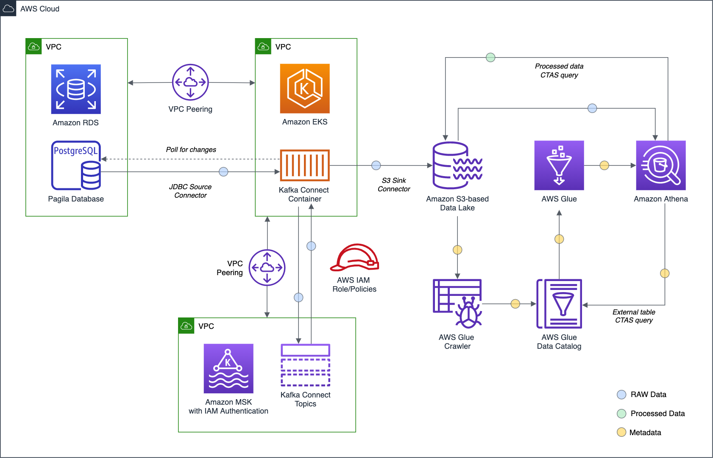

# CDC with Amazon EKS, Amazon MSK, and Apache Kafka Connect

Source code for the
post, [Hydrating a Data Lake using Change Data Capture (CDC), Apache Kafka, and Kubernetes on AWS](https://itnext.io/hydrating-a-data-lake-using-query-based-cdc-with-apache-kafka-connect-and-kubernetes-on-aws-cd4725b58c2e)

## Architecture



## Create the K8s Service Account (IRSA)

```shell
export AWS_ACCOUNT=$(aws sts get-caller-identity --output text --query 'Account')
export EKS_REGION="us-east-1"
export CLUSTER_NAME="<your-eks-cluster>"
export NAMESPACE="kafka"

eksctl create iamserviceaccount \
  --name kafka-connect-msk-iam-serviceaccount \
  --namespace $NAMESPACE \
  --region $EKS_REGION \
  --cluster $CLUSTER_NAME \
  --attach-policy-arn "arn:aws:iam::${AWS_ACCOUNT}:policy/EKSKafkaConnectMSKPolicy" \
  --approve \
  --override-existing-serviceaccounts
```

## Get a Shell into the Running Kafka Connect Container on EKS

```shell
export KAFKA_CONTAINER=$(
  kubectl get pods -n kafka -l app=kafka-connect-msk | \
    awk 'FNR == 2 {print $1}')

kubectl exec -it $KAFKA_CONTAINER -n kafka -- bash
```

## Start Kafka Connect as Background Process

```shell
bin/connect-distributed.sh config/connect-distributed.properties > /dev/null 2>&1 &

tail -f logs/connect.log
```

## Kafka Connect REST API Cheat Sheet

```shell
# check kafka connect status
curl -X GET http://localhost:8083

# get plugins
curl -X GET http://localhost:8083/connector-plugins | jq

# add sink config with post
curl -s -d @"config/jdbc_source_connector_postgresql_00.json" \
    -H "Content-Type: application/json" \
    -X POST http://localhost:8083/connectors | jq

# add source config with post
curl -s -d @"config/s3_sink_connector_00.json" \
    -H "Content-Type: application/json" \
    -X POST http://localhost:8083/connectors | jq

# add/update source config with put (better!)
curl -s -d @"config/jdbc_source_connector_postgresql_00.json" \
    -H "Content-Type: application/json" \
    -X PUT http://localhost:8083/connectors/jdbc_source_connector_postgresql_00/config | jq

# add/update sink config with put (better!)
curl -s -d @"config/s3_sink_connector_00.json" \
    -H "Content-Type: application/json" \
    -X PUT http://localhost:8083/connectors/s3_sink_connector_00/config | jq

# get connectors
curl -s -X GET http://localhost:8083/connectors | jq

curl -s -H "Content-Type: application/json" \
    -X POST http://localhost:8083/connectors/jdbc_source_connector_postgresql_01/restart

curl -s -H "Content-Type: application/json" \
    -X GET http://localhost:8083/connectors/jdbc_source_connector_postgresql_00/status

curl -s -H "Content-Type: application/json" \
    -X DELETE http://localhost:8083/connectors/jdbc_source_connector_postgresql_00

# change log level
curl -s -X PUT -H "Content-Type:application/json" \
    http://localhost:8083/admin/loggers/org.apache.kafka.connect.runtime.WorkerSourceTask \
    -d '{"level": "TRACE"}' | jq '.'
```

## Kafka Command-line Cheat Sheet

```shell
# list consumer groups
bin/kafka-consumer-groups.sh --list \
  --bootstrap-server $BBROKERS \
  --command-config config/client-iam.properties

# describe consumer group
bin/kafka-consumer-groups.sh --describe \
  --bootstrap-server $BBROKERS \
  --group amazon.msk.canary.group.broker-1 \
  --command-config config/client-iam.properties

# delete consumer group
bin/kafka-consumer-groups.sh --delete \
  --group connect-s3_sink_connector_03 \
  --bootstrap-server $BBROKERS \
  --command-config config/client-iam.properties

# list topics
bin/kafka-topics.sh --list \
  --bootstrap-server $BBROKERS \
  --command-config config/client-iam.properties

# describe topic
bin/kafka-topics.sh --describe \
  --topic pagila.public.address \
  --bootstrap-server $BBROKERS \
  --command-config config/client-iam.properties

# delete topic
bin/kafka-topics.sh --delete \
  --topic pagila.public.address \
  --bootstrap-server $BBROKERS \
  --command-config config/client-iam.properties

# get topic size
bin/kafka-log-dirs.sh --describe \
  --bootstrap-server $BBROKERS \
  --topic-list pagila.query \
  --command-config config/client-iam.properties

# read topic from the beginning
bin/kafka-console-consumer.sh \
  --topic pagila.public.address \
  --from-beginning \
  --bootstrap-server $BBROKERS \
  --consumer.config config/client-iam.properties \

# reset consumer group offset on a topic
bin/kafka-consumer-groups.sh \
  --group connect-s3_sink_connector_02 \
  --reset-offsets --to-earliest --execute \
  --topic pagila.query \
  --bootstrap-server $BBROKERS \
  --command-config config/client-iam.properties

# purge topic (set retention time to 1000ms)
bin/kafka-configs.sh \
  --entity-type topics --alter \
  --entity-name pagila.public.address \
  --add-config retention.ms=1000 \
  --bootstrap-server $BBROKERS \
  --command-config config/client-iam.properties

# remove/revert retention time (604800000 (7 days))
bin/kafka-configs.sh \
  --entity-type topics --alter \
  --entity-name pagila.public.address \
  --delete-config retention.ms \
  --bootstrap-server $BBROKERS \
  --command-config config/client-iam.properties

# read messages from topic
bin/kafka-console-consumer.sh \
  --topic pagila.public.alt.address --from-beginning --max-messages 10 \
  --property print.key=true --property print.value=true \
  --property print.offset=true --property print.partition=true \
  --property print.headers=true --property print.timestamp=true \
  --bootstrap-server $BBROKERS \
  --consumer.config config/client-iam.properties

# read messages from topic
bin/kafka-console-consumer.sh \
  --topic pagila.query \
  --offset 100 --partition 0 --max-messages 10 \
  --property print.key=true --property print.value=true \
  --property print.offset=true --property print.partition=true \
  --property print.headers=false --property print.timestamp=false \
  --bootstrap-server $BBROKERS \
  --consumer.config config/client-iam.properties
```

---

<i>The contents of this repository represent my viewpoints and not of my past or current employers, including Amazon Web
Services (AWS). All third-party libraries, modules, plugins, and SDKs are the property of their respective owners.</i>
